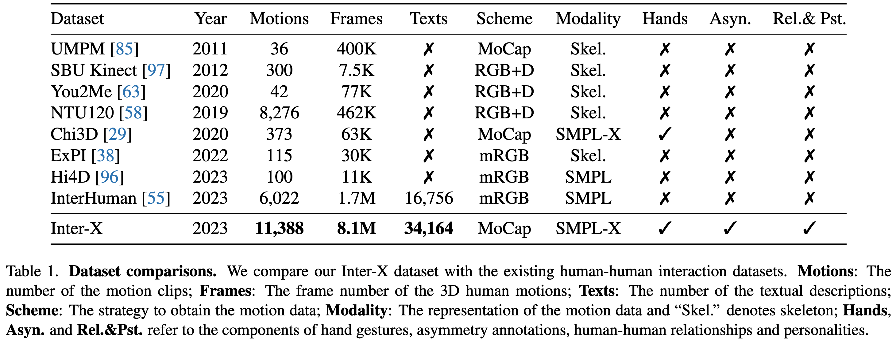

# Inter-X: Towards Versatile Human-Human Interaction Analysis


<p align="left">
  <a href='https://arxiv.org/abs/2312.16051'>
    
  </a>
  <a href='https://arxiv.org/pdf/2312.16051.pdf'>
    
  </a>
  <a href='https://liangxuy.github.io/inter-x/'>
  </a>
  <a href="" target='_blank'>
    
  </a>
</p>

This repository contains the content of the following paper:
> Inter-X: Towards Versatile Human-Human Interaction Analysis <br>[Liang Xu](https://liangxuy.github.io/)<sup>1,2</sup>, Xintao Lv<sup>1</sup>, [Yichao Yan](https://daodaofr.github.io/)<sup>1</sup>,  [Xin Jin](http://home.ustc.edu.cn/~jinxustc/)<sup>2</sup>, Shuwen Wu<sup>1</sup>, Congsheng Xu<sup>1</sup>, Yifan Liu<sup>1</sup>, [Yizhou Zhou](https://scholar.google.com/citations?user=dHBNmSkAAAAJ&hl=zh-CN)<sup>3</sup>, [Fengyun Rao](https://scholar.google.com/citations?user=38dACd4AAAAJ&hl=en)<sup>3</sup>, Xingdong Sheng<sup>4</sup>, Yunhui Liu<sup>4</sup>,  [Wenjun Zeng](https://scholar.google.com/citations?user=_cUfvYQAAAAJ&hl=en)<sup>2</sup>, [Xiaokang Yang](https://scholar.google.com/citations?user=yDEavdMAAAAJ&hl=zh-CN)<sup>1</sup><br>
> <sup>1</sup> Shanghai Jiao Tong University <sup>2</sup> Eastern Institute of Technology, Ningbo <sup>3</sup>WeChat, Tencent Inc. <sup>4</sup>Lenovo

## News
- [2024.04.16] Release the Inter-X dataset, with SMPL-X parameters, skeleton parameters, and the annotations of textual descriptions, action settings, interaction order and relationships and personalities.
- [2024.02.27] Inter-X is accepted by CVPR 2024!
- [2023.12.27] We release the paper and project page of Inter-X.

## TODO
- [ ] Release the data pre-processing code.
- [x] Release the scripts to visualize the dataset.
- [x] Release the whole dataset and annotations.


**Plese stay tuned for any updates of the dataset and code!**

## Dataset Comparison



## Dataset Download
Please fill out [this form](https://forms.gle/Fp3wF6FNavwyrV8n9) to request authorization to download Inter-X for research purposes.

We also provide the [40 action categories](datasets/action_setting.txt) and [train](datasets/train.txt)/[val](datasets/val.txt)/[test](datasets/test.txt) splittings under the folder of `datasets`.

## Data visualization
### 1. Visualize the SMPL-X parameters

We recommend to use the [AIT-Viewer](https://github.com/eth-ait/aitviewer) to visualize the dataset.

```bash
pip install aitviewer
pip install -r visualize/smplx_viewer_tool/requirements.txt
```

#### Installation

You need to download the [SMPL-X models](https://smpl-x.is.tue.mpg.de/) and then place them under `visualize/smplx_viewer_tool/body_models`.

```
├── SMPLX_FEMALE.npz
├── SMPLX_FEMALE.pkl
├── SMPLX_MALE.npz
├── SMPLX_MALE.pkl
├── SMPLX_NEUTRAL.npz
├── SMPLX_NEUTRAL.pkl
└── SMPLX_NEUTRAL_2020.npz
```

#### Usage

```bash
cd visualize/smplx_viewer_tool
# 1. Make sure the SMPL-X body models are downloaded
# 2. Create a soft link of the SMPL-X data to the smplx_viewer_tool folder
ln -s Your_Path_Of_SMPL-X ./data
# 3. Create a soft link of the texts annotations to the smplx_viewer_tool folder
ln -s Your_Path_Of_Texts ./texts
python data_viewer.py
```


### 2. Visualize the skeleton parameters

#### Usage

```bash
cd visualize/joint_viewer_tool
# 1. Create a soft link of the skeleton data to the joint_viewer_tool folder
ln -s Your_Path_Of_Joints ./data
# 2. Create a soft link of the texts annotations to the joint_viewer_tool folder
ln -s Your_Path_Of_Texts ./texts
python data_viewer.py
```

## Data Loading

Each file/folder name of Inter-X is in the format of `GgggTtttAaaaRrrr` (e.g., G001T000A000R000), in which ggg is the human-human group number, ttt is the shoot number, aaa is the action label, and rrr is the split number. 

The human-human group number is aligned with the big_five, familiarity annotations. The human-human group number starts from 001 to 059, the action label starts from 000 to 039.

The directory structure of the downloaded dataset is:

```bash
Inter-X_Dataset
├── LICENSE.md
├── annots
│   ├── action_setting.txt # 40 action categories
│   ├── big_five.npy # big-five personalities
│   ├── familiarity.txt # familiarity level, from 1-4, larger means more familiar
│   └── interaction_order.pkl # actor-reactor order, 0 means P1 is actor; 1 means P2 is actor
├── splits # train/val/test splittings
│   ├── all.txt
│   ├── test.txt
│   ├── train.txt
│   └── val.txt
├── motions.zip # SMPL-X parameters at 120 fps
├── skeletons.zip # skeleton parameters at 120 fps
└── texts.zip # textual descriptions
```

- To load the SMPL-X motion parameters you can simply do:
```python
import numpy as np

# load the motion data
motion = np.load('motions/G001T000A000R000/P1.npz')
motion_parms = {
            'root_orient': motion['root_orient'],  # controls the global root orientation
            'pose_body': motion['pose_body'],  # controls the body
            'pose_lhand': motion['pose_lhand'],  # controls the left hand articulation
            'pose_rhand': motion['pose_rhand'],  # controls the right hand articulation
            'trans': motion['trans'],  # controls the global body position
            'betas': motion['betas'],  # controls the body shape
            'gender': motion['gender'],  # controls the gender
        }
```
- To load the skeleton data you can simply do:
```python
# The topology of the skeleton can be obtained in the OPTITRACK_LIMBS, SELECTED_JOINTS of the joint_viewer_tool/data_viewer.py
import numpy as np
skeleton = np.load('skeletons/G001T000A000R000/P1.npy') # skeleton.shape: (T, 64, 3)
```

## Data preprocessing
We will update this part as soon as possible.

## Citation
If you find the Inter-X dataset is useful for your research, please cite us:

```
@inproceedings{xu2023inter,
  title={Inter-X: Towards Versatile Human-Human Interaction Analysis},
  author={Xu, Liang and Lv, Xintao and Yan, Yichao and Jin, Xin and Wu, Shuwen and Xu, Congsheng and Liu, Yifan and Zhou, Yizhou and Rao, Fengyun and Sheng, Xingdong and Liu, Yunhui and Zeng, Wenjun and Yang, Xiaokang},
  booktitle={CVPR},
  year={2024}
}
```